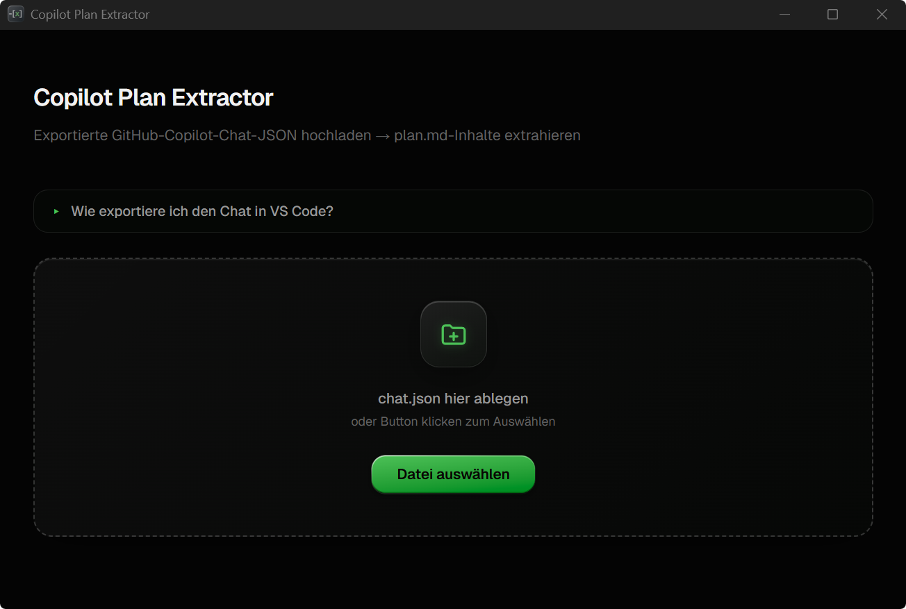
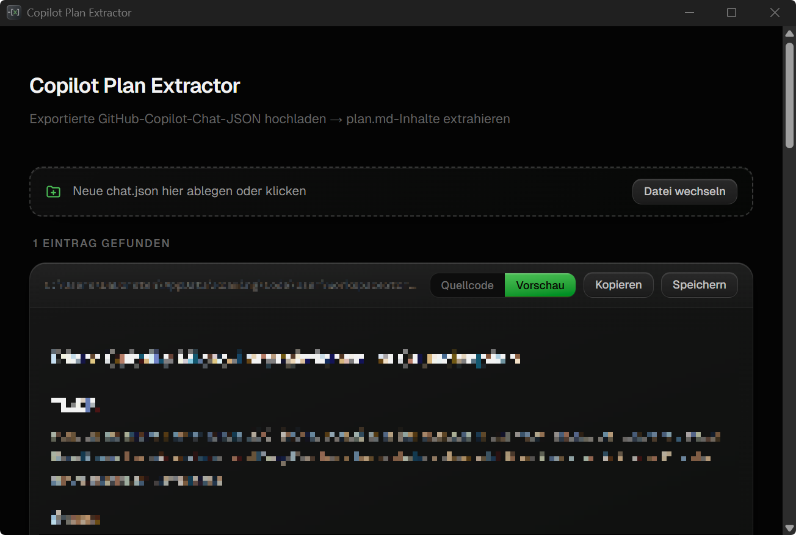
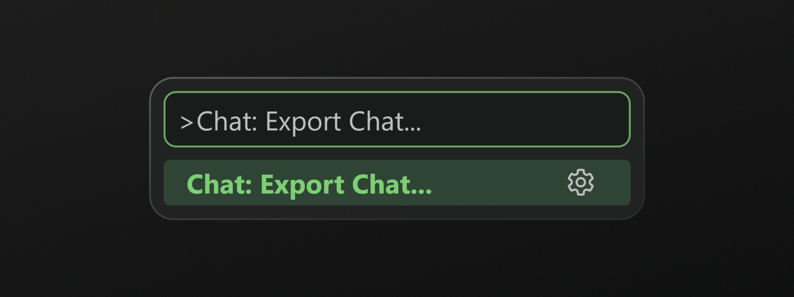

# Copilot Plan Exporter

<p align="center">
  
</p>

<p align="center">
  A lightweight desktop app to extract and view <code>plan.md</code> files from GitHub Copilot Chat exports.
</p>

---

## Overview

GitHub Copilot Chat stores conversation history as `chat.json` files. When Copilot references a `plan.md` during a session, that reference is embedded in the JSON — but reading it raw is painful.

**Copilot Plan Extractor** parses those export files, finds every `plan.md` reference, resolves the file path on your system, and presents the content in a clean, readable UI — with both rendered Markdown and raw source views.

---

## Screenshot

<p align="start">
  
</p>

<p align="start">
  
</p>

---

## Features

- **Drag & drop** a `chat.json` file or use the file picker
- **Renders Markdown** with GitHub-flavored syntax (tables, checkboxes, code blocks)
- **Toggle** between rendered view and raw source
- **Copy to clipboard** or **save to file** any extracted plan
- **Cross-platform** path resolution — handles Windows drive letters and VS Code URI format
- Instant feedback via toast notifications

---

## Tech Stack

| Layer | Technology |
|-------|-----------|
| Desktop shell | [Tauri v2](https://tauri.app) (Rust) |
| Frontend | React 19 + TypeScript |
| Styling | Tailwind CSS v4 |
| Bundler | Vite + Bun |
| Markdown | react-markdown + remark-gfm |

---

## Getting Started

### Prerequisites

- [Rust](https://rustup.rs/) (stable toolchain)
- [Bun](https://bun.sh/)
- Platform build tools (see [Tauri prerequisites](https://tauri.app/start/prerequisites/))

### Install & Run

```bash
bun install
bun run tauri dev
```

### Build

```bash
bun run tauri build
```

Outputs are placed in `src-tauri/target/release/bundle/`.

---

## How to Export a Copilot Chat

1. Open the GitHub Copilot Chat panel in VS Code
2. Click the **...** menu on a conversation
3. Select **Export Chat** → saves a `chat.json` file
4. Open that file in Copilot Plan Extractor

<p align="start">
  
</p>

---

## License

<a href="LICENSE">MIT License</a>
